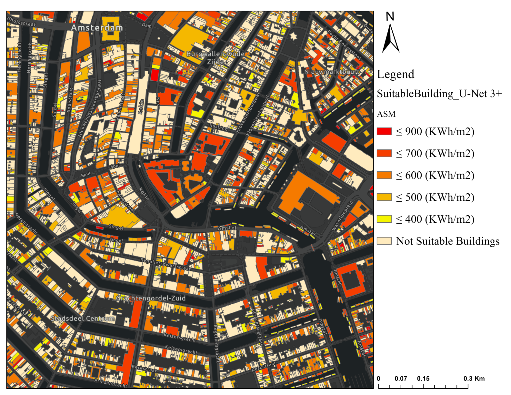

# Solar Energy Potential Estimation Using U-Net 3+

This repository contains the implementation of a **deep learning framework for urban rooftop solar energy potential estimation** using **LiDAR-derived Digital Surface Models (DSMs)**.  
The code accompanies the research paper:  
> **Deep Learning-Based Solar Energy Potential Estimation Using LiDAR-Derived DSM: A U-Net3+ Approach for Urban Rooftop Applications**  
> Maryam Hosseini, Sina Irannejad, and Hossein Bagheri  

---

## 📄 Overview

As cities seek sustainable energy solutions, **accurately mapping rooftop solar potential** is critical for planning photovoltaic (PV) installations.  
Traditional physical models (e.g., the Area Solar Radiation (ASR) model) provide accurate solar energy potential maps but are **computationally intensive** and time-consuming.  

This project demonstrates how **U-Net3+**, a deep convolutional neural network, can efficiently predict **Annual Solar Energy Potential Maps (ASM)** from high-resolution LiDAR DSMs.  
The deep learning approach provides:  
- **Faster computation** than physical models  
- High accuracy comparable to ASR model outputs  
- Capability to generalize to other urban areas  

---

## 🌍 Study Area

The framework was tested in **Amsterdam, Netherlands**, using LiDAR DSM data with a 0.5 m spatial resolution from the [AHN3 dataset](https://www.ahn.nl/).  

---

## ⚡ Methodology

The pipeline consists of the following main steps:

1. **Data Preparation**
   - LiDAR DSM (0.5 m resolution) was processed to generate reference solar potential maps using the **ASR model** in ArcGIS Pro.
   - 128 × 128 pixel patches were extracted for model training, validation, and testing.

2. **Deep Learning Models**
   - Three U-Net variants were tested:
     - Standard **U-Net**
     - **Attention U-Net**
     - **U-Net 3+** (final selected model)
   - Models were trained to regress ASM values from DSM inputs.

3. **Evaluation**
   - Performance was assessed using **RMSE**, **MAE**, and **R²** metrics compared to the ASR-generated reference ASM.
   - U-Net 3+ achieved:
     - R² = **0.91** (test set)
     - RMSE = **94.35 KWh/m²**

4. **Solar Panel Placement**
   - Predicted ASM was combined with rooftop building footprints (from [OpenStreetMap](https://www.openstreetmap.org/)) and filtered based on:
     - Minimum rooftop area (≥30 m²)
     - Maximum slope (≤45°)
     - Suitable orientation (non-north-facing)

---

## 📊 Key Results

| Model          | R² (Test) | RMSE (KWh/m²) | MAE (KWh/m²) |
|----------------|-----------|---------------|--------------|
| U-Net          | 0.81      | 138.53        | 79.42       |
| Attention U-Net| 0.86      | 119.70        | 72.39       |
| **U-Net 3+**   | **0.91**  | **94.35**     | **59.05**   |

- **Computation Time**:  
  - ASR model: **14h 24m**  
  - U-Net 3+: **3h 39m (training)** and **24s (prediction)**  

---

## ⚙️ Requirements

- Python 3.8+
- TensorFlow / Keras
- NumPy, Pandas, Matplotlib
- GDAL (for geospatial data handling)

---

## 🚀 Usage

1. **Prepare Data**  
   - Download DSM tiles from [AHN3](https://www.ahn.nl/) or use the provided sample dataset.
   - Generate reference ASM using the ASR model in ArcGIS (optional, if training from scratch).

2. **Train the Model & Predict Solar Energy Potential**  
   - Run Jupyter Notebooks in Model folder

4. **Rooftop Solar Panel Placement**  
   - Use the predicted ASM and building footprints to locate suitable rooftop installations using ArcGIS pro.

---

## 📦 Data

- **LiDAR DSM**: [AHN3 dataset](https://www.ahn.nl/) (0.5 m resolution)
- **Reference ASM**: Generated with the ASR model in ArcGIS Pro
- **Building Footprints**: [OpenStreetMap](https://www.openstreetmap.org/)

Supplementary datasets used in the study are available on [Zenodo](https://zenodo.org/records/14214616).  

---

## Result: 

 
<strong>Figure 1:</strong> Building suitability map for solar panel installation. Colors represent annual average solar energy potential (kWh/m²). The Map of building suitability for solar panel installation is generated based on the annual average solar energy potential received by rooftops, produced by the U-Net 3+ model

---

## 🖋️ Authors

- **Maryam Hosseini** – Data preparation, model training, manuscript writing  
- **Sina Irannejad** – Data preparation, analysis  
- **Hossein Bagheri** – Supervision, project design, manuscript revision  

---

## 📜 License

This repository is released under the **MIT License**.  
